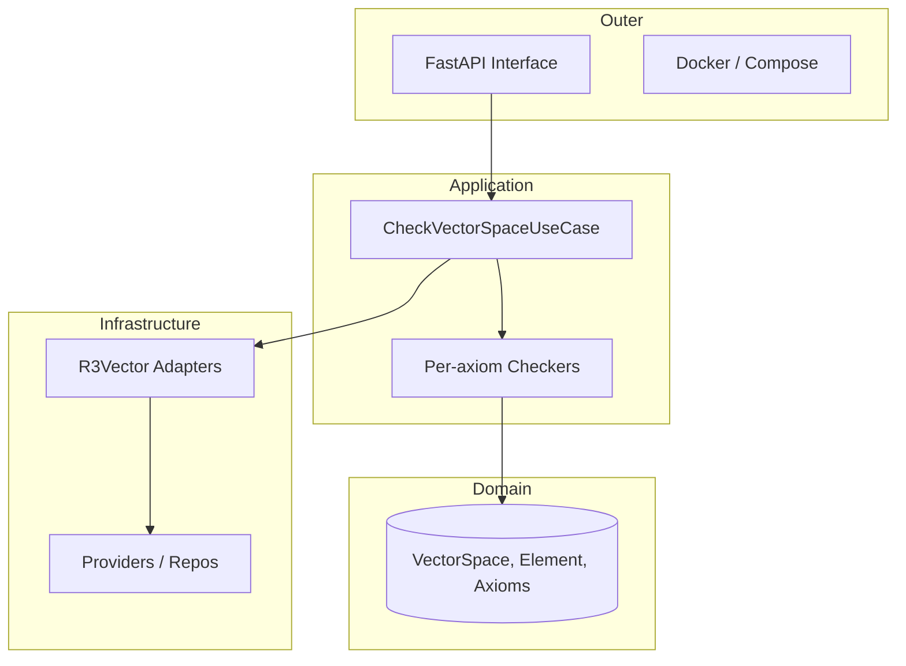

# Algebra Analyser API — Clean Architecture

[](https://www.python.org/)
[](./LICENSE)
[](https://www.docker.com/)
[](#)

A compact, production-oriented API implemented in Python + FastAPI that verifies whether a given set and operations satisfy the 10 axioms of a vector space. Built with Clean Architecture (Ports & Adapters) so the algebraic core is decoupled from delivery and infrastructure.

Table of Contents

- [Why this project](#why-this-project)
- [Highlights](#highlights)
- [Architecture](#architecture)
- [Quickstart](#quickstart)
  - [Docker (recommended)](#docker-recommended)
  - [Local (Poetry)](#local-poetry)
- [Usage](#usage)
  - [Available Spaces (recipes)](#available-spaces-recipes)
  - [API: Check vector space](#api-check-vector-space)
  - [Example responses](#example-responses)
- [Extending / Adding new algebraic structures](#extending--adding-new-algebraic-structures)
- [Development notes](#development-notes)
- [Contributing](#contributing)
- [License](#license)

## Why this project

This repository is both an educational tool and a demonstration of clean, testable architecture:

- Validates algebraic structures (R³, variations, and future types) against vector space axioms.
- Uses Clean Architecture: domain core is independent, making algorithms reusable and testable.
- Provides detailed, actionable feedback when an axiom fails.

## Highlights

- Clear separation of Domain, Application, Infrastructure, Interface.
- JSON responses showing axiom pass/fail with precise counterexamples.
- Containerized for reproducible runs.
- Easily extensible to R², matrices, polynomials, etc.

## Architecture

Clean Architecture with Ports & Adapters. Core ideas:

- Domain: entities, axioms, and pure algebraic logic (no external deps).
- Application: orchestrates use cases (CheckVectorSpaceUseCase).
- Infrastructure: concrete vector implementations & adapters (R3Vector, providers).
- Interface: FastAPI app exposing endpoints.
- Containers: composition root instantiating and wiring dependencies.




## Quickstart

Two recommended ways to run.

Docker (recommended)

1. Ensure Docker Desktop is installed.
2. Clone and run:
   ```bash
   git clone git@github.com:brennohdev/linear-algebra-lab.git
   cd core_studies
   docker-compose up --build
   ```
3. API: http://127.0.0.1:8000
4. Swagger UI: http://127.0.0.1:8000/docs

Local (Poetry)

1. Python 3.14+ and Poetry installed.
2. Clone and install:
   ```bash
   git clone git@github.com:brennohdev/linear-algebra-lab.git
   cd core_studies
   poetry install
   poetry shell
   uvicorn src.core_studies.interface.api.main:app --reload
   ```
3. API: http://127.0.0.1:8000
4. Swagger UI: http://127.0.0.1:8000/docs

## Usage

Endpoint

- POST /v1/check-space/{space_name}

Description: Runs the configured checks for a pre-defined algebraic "recipe" and returns whether the structure satisfies all vector space axioms along with detailed failures (if any).

Available Spaces (recipes)

- R3_STANDARD — Standard R³ with conventional vector addition and scalar multiplication.
- R3_RULE_X_ONLY_MULT — R³ with standard addition but modified scalar multiplication: k * (x,y,z) = (k*x, y, z)
- (Add more recipes by adding adapters in containers.py)

Example curl

```bash
curl -X POST "http://127.0.0.1:8000/v1/check-space/R3_STANDARD"
```

Example Success Response (R3_STANDARD)

```json
{
  "is_vector_space": true,
  "failures": []
}
```

Example Failure Response (R3_RULE_X_ONLY_MULT)

```json
{
  "is_vector_space": false,
  "failures": [
    {
      "axiom": "A8: Distributivity (Scalar Addition)",
      "reason": "Axiom requires: (k + l) * u == k*u + l*u\nInputs:\n  k = -1.0\n  l = 0.0\n  u = R3Vector(x=-6.6..., y=3.2..., z=-8.1...)\nCalculation:\n  LHS (k + l) * u = R3Vector(x=6.6..., y=3.2..., z=-8.1...)\n  RHS k*u + l*u   = R3Vector(x=6.6..., y=6.4..., z=-16.3...)\nResult: LHS != RHS"
    }
  ]
}
```

## Extending / Adding new algebraic structures

To add support for a new structure (R², matrices, polynomials):

1. Implement a concrete Element (e.g., R2Vector, Matrix) in Infrastructure that satisfies Domain ports.
2. Wire the implementation in containers.py by creating a new "recipe".
3. Add tests for each axiom implementation using the domain-level checkers.

## Development notes

- Keep domain code pure: no network, I/O, or framework code.
- Unit-test the domain and per-axiom checkers first; mock providers when testing Application.
- Use the containers file as the single composition root for dependency injection.

## Contributing

- Open an issue to discuss larger changes.
- Use small focused PRs with descriptive commit messages.
- Follow the repository's code style and add tests for new features.

## License

MIT — see LICENSE file.

## Contact & Credits

This project is authored as a learning + demonstration tool for clean architecture applied to algebraic verification. For questions or suggestions, open an issue or submit a PR.

## Changelog (short)

- v0.1.0 — Initial implementation: R3 recipes, axiom checkers, FastAPI interface, Docker support.

Enjoy exploring vector spaces with reproducible, explainable checks.
